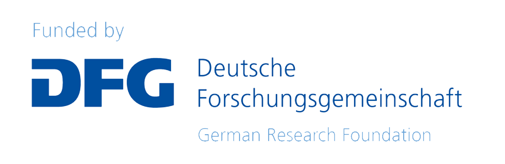

## Overview of Cheminformatics Python Microservice

This set of essential and valuable microservices is designed to be accessed via API calls to support cheminformatics. Generally, it is designed to work with SMILES-based inputs and could be used to translate between different machine-readable representations, get Natural Product (NP) likeliness scores, visualize chemical structures, and generate descriptors. In addition, the microservices also host an instance of [STOUT](https://github.com/Kohulan/Smiles-TO-iUpac-Translator) and another instance of [DECIMER](https://github.com/Kohulan/DECIMER-Image_Transformer) (two deep learning models for IUPAC name generation and optical chemical structure recognition, respectively).

## Documentation

https://steinbeck-lab.github.io/cheminformatics-python-microservice/

### API Swagger Docs:

Production: https://api.naturalproducts.net/latest/docs

Development: https://dev.api.naturalproducts.net/latest/docs

## License

This project is licensed under the MIT License - see the [LICENSE](https://github.com/Steinbeck-Lab/cheminformatics-python-microservice/blob/dev-kohulan/LICENSE) file for details

## Citation

Venkata, C., Sharma, N., & Rajan, K. (2023). Cheminformatics Python Microservice (Version V1.0.0) [Computer software]. https://doi.org/10.5281/zenodo.7747862

## Maintained by

Cheminformatics Python Microservice and [Natural Products Online](https://naturalproducts.net) are developed and maintained by the [Steinbeck group](https://cheminf.uni-jena.de) at the [Friedrich Schiller University](https://www.uni-jena.de/en/) Jena, Germany. 
The code for this web application is released under the [MIT license](https://opensource.org/licenses/MIT). Copyright © CC-BY-SA 2023

## Acknowledgments

Funded by the [Deutsche Forschungsgemeinschaft (DFG, German Research Foundation)](https://www.dfg.de/) under the [National Research Data Infrastructure – NFDI4Chem](https://nfdi4chem.de/) – Projektnummer **441958208**.

